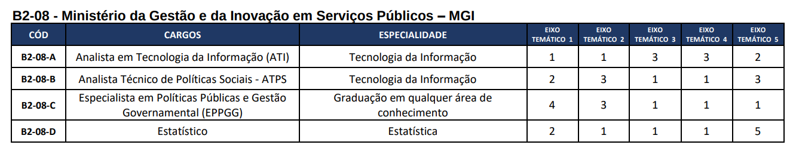
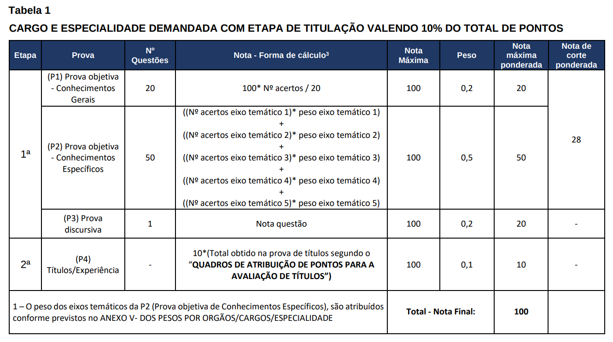

# Calculadora de Desempenho Parcial do CNU

Este script em Python processa as suas respostas do CNU, calculando o número de respostas corretas e as porcentagens de acerto por seção temática, considerando os pesos associados a um cargo específico de sua escolha.

## Pré-requisitos

Antes de executar este script, assegure-se de ter o Python instalado em sua máquina.

## Instruções de Uso

1. Edite os seguintes arquivos com os dados corretos para o cargo de seu interesse:

   - `my_answers.json` - adicione suas respostas.
   - `correct_answers.json` - insira as respostas corretas de acordo com o gabarito de sua prova.
   - `thematic_weights.json` - insira os pesos dos eixos temáticos específicos para o seu cargo (presentes no edital). Por exemplo, para o cargo _B2-08-A_ na tabela abaixo, os pesos por eixo temático são:

   
   ```js
   {
        "axis_1": 1,
        "axis_2": 1,
        "axis_3": 3,
        "axis_4": 3,
        "axis_5": 2
   }
   ```

   - `role_weights.json` - insira os pesos referentes ao cálculo da nota relacionados aos conhecimentos gerais e específicos presentes no edital. Por exemplo, para um cargo relativo á tabela abaixo, os pesos para conhecimentos gerais e conhecimentos específicos são os pesos de P1 e P2:

    

   ```js
   {
    "general_knowledge": 0.2,
    "specific_knowledge": 0.5
   }
   ```
    

2. Execute o script usando o seguinte comando:

    ```bash
    python calculate_results.py
    ```

3. O resultado do script será semelhante a:

    ```bash
    {
        "general_knowledge": {
            "correct_answers": 14,
            "percentage": 70.0,
            "score": 70
        },
        "specific_knowledge": {
            "axis_1": {
                "correct_answers": 6,
                "percentage": 60.0,
                "weighted_score": 6.0
            },
            "axis_2": {
                "correct_answers": 8,
                "percentage": 80.0,
                "weighted_score": 8.0
            },
            "axis_3": {
                "correct_answers": 7,
                "percentage": 70.0,
                "weighted_score": 21.0
            },
            "axis_4": {
                "correct_answers": 8,
                "percentage": 80.0,
                "weighted_score": 24.0
            },
            "axis_5": {
                "correct_answers": 4,
                "percentage": 40.0,
                "weighted_score": 8.0
            }
        },
        "final": {
            "general_knowledge_weighted_score": 14.0,
            "specific_knowledge_weighted_score": 33.5,
            "final_score": 47.5
        }
    }
    ```